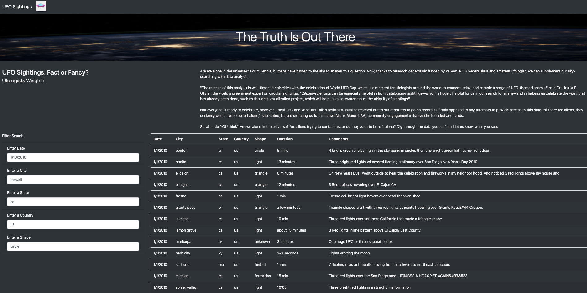
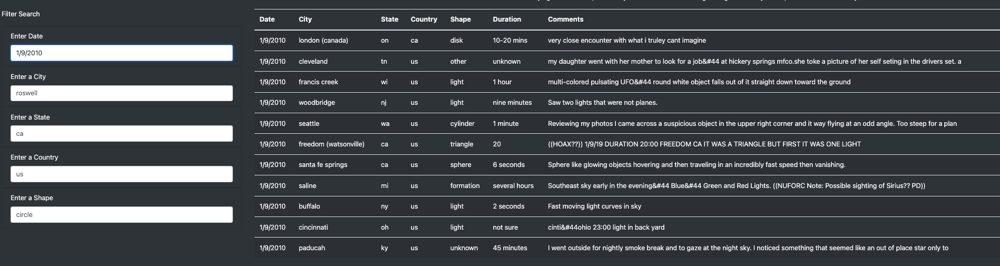
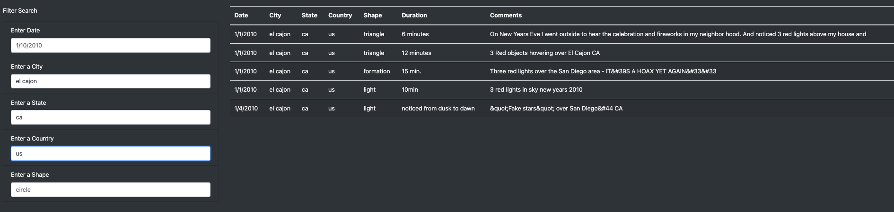
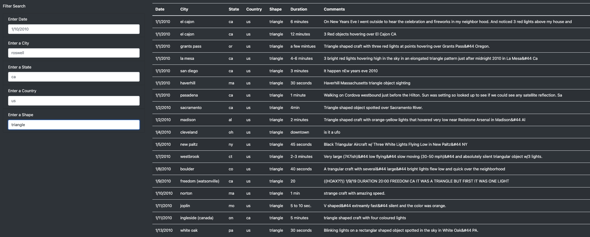

# UFOs
---

## Overview

This paper will provide a more in-depth analysis of UFO sightings by using JavaScript and HTML to allow users to filter for multiple criteria at the same time. In addition to the date, table filters will be added for the city, state, country, and shape.

## Aim 

The purpose of this paper is to;
  - Filter UFO sightings on multiple criteria

---
## Results

This part of the paper will describe how someone might use the new webpage by walking through the process of using the search criteria. 

**Homepage**

This is the inital page that the user will be taken to. Here there is a title, subheading, a short description, as well as the data and a fiter search. 

 

 

Homepage

**Filter by Date**

The first way to filter is by a date. Putting in a date, such as '1/9/2010', will pull back the information that corresponds with this date. If a date is entered with no corresponding data, the table will pull back empty. 

 

 

Filter by Date

**Filter by Location**

The next way to filter is by location. The filter search is broken up into 3 types of locations, depending on how narrow you want the search, by City, State or Country. 

 

 

Filter by Location

**Filter by Shape**

The last way to filter is by shape. Similarly to the other two searches, just put the shape of the object into the search box and the results will appear if there are any corresponding resutls. 

 

 

Filter by Shape

--- 
## Summary 

- One drawback of this design is that you need to know what filters to put in to be able to search.
- Another drawback, is that correct spelling is needed, there is no room for spelling error

- One recommendation to this, would be to have a drop down list in the filter search, rather than having to type in the information yourself. 
- Another recommendation would be to introduce a 'clear' button, to easily clear the filters and start again. 
